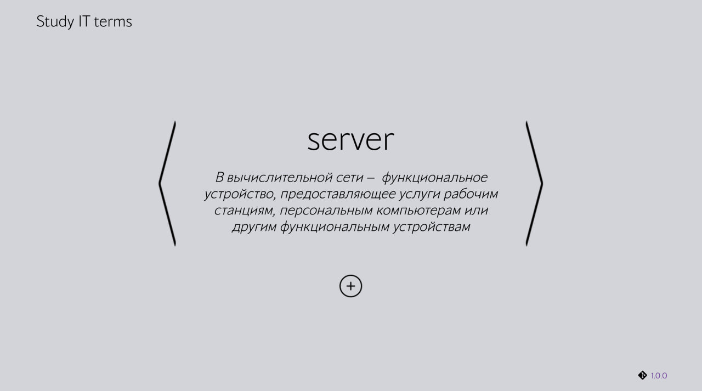
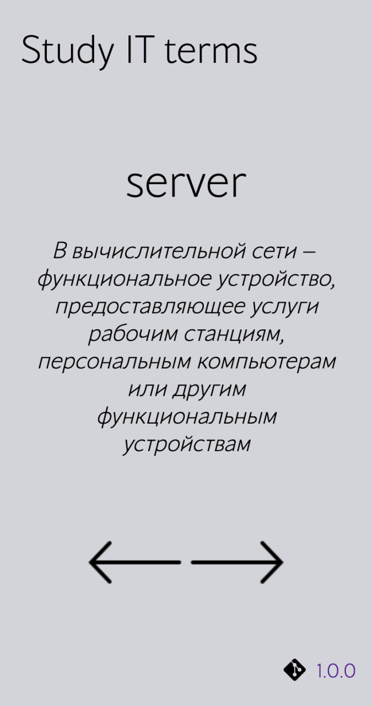

 

# About

LearningTerms - minimalistic service for studying IT terms and definitions. Click on the left and right arrows to switch the term. The system remembers which term you stayed on for the last time. There is also a function for adding your own terms and definitions.

### Example of the desktop version
 

 

 

### Example of the mobile version

 
